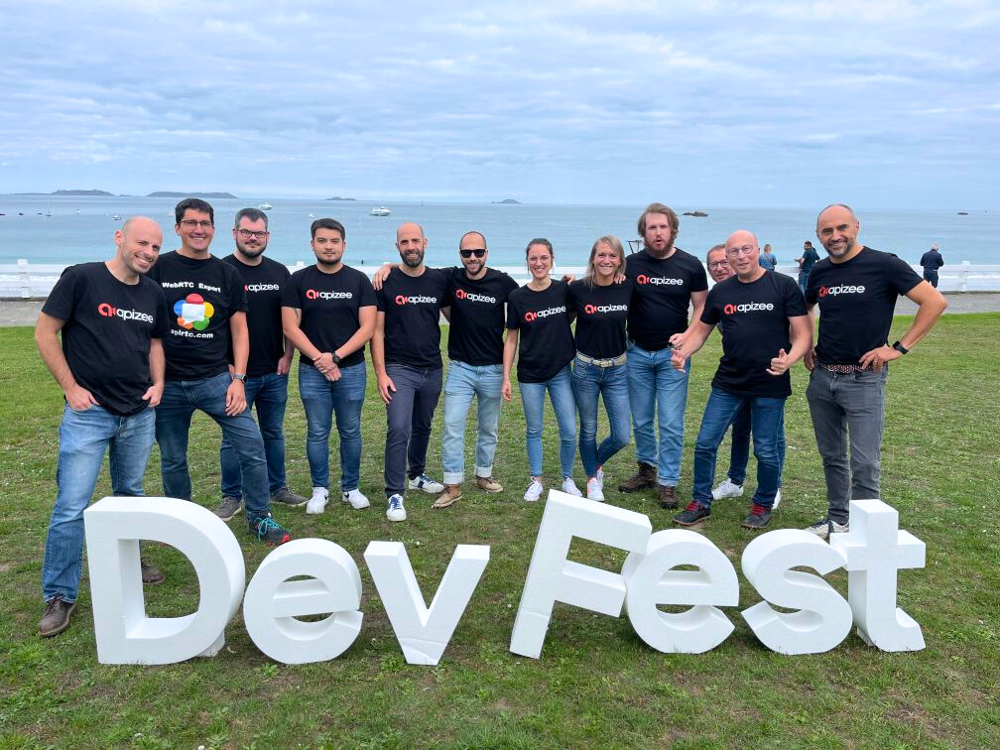

 

# Perros-Guirec 2023

---

# L'importance de l'IA pour les entreprises SaaS

## Transformation du métier
L'IA redéfinit continuellement le développement logiciel.
## Productivité accrue
L'IA peut augmenter la productivité des développeurs de 30%.
## Outils innovants
Des outils comme GitHub Copilot assistent les développeurs de manière inédite.
## Optimisation & Performance
L'IA offre des méthodes d'optimisation avancées pour améliorer la qualité et la performance.

## Éthique & Régulation
Les entreprises doivent être conscientes des biais et des implications éthiques.
## Impact environnemental
L'IA a un impact sur l'environnement, à considérer dans la stratégie globale.
## Ne pas rester à la traîne
Les leaders du SaaS intègrent déjà l'IA; ne manquez pas cette révolution !

---

# L'impact de l'IA sur le métier de développeur

- L'IA a continuellement transformé le métier de développeur ces dernières années.
- Les développeurs sont au cœur de l'évolution technologique liée à l'IA.
- L'IA nécessite une main-d'œuvre importante pour les aspects de back-office et d'orchestration.
- Les développeurs jouent un rôle essentiel dans la direction de l'évolution de l'IA.

---

# L'IA en météorologie

- L'IA est utilisée pour analyser les photos satellites/aériennes militaires.
- MétéoFrance utilise l'IA pour prévoir les précipitations via satellite et radar.
- L'IA permet d'optimiser la qualité de la prévision en choisissant les bonnes sources d'information.
- L'IA améliore également la précision des prédictions météorologiques.

---

# Régulation et éthique de l'IA

- Les biais dans l'IA peuvent conduire à des décisions inexactes ou injustes.
- Exemple : L'IA RH d'Amazon qui favorisait les CV masculins.
- Les discussions sur la régulation des algorithmes sont en cours.
- L'IA reflète à la fois les qualités et les défauts de l'humanité.

---

# Outils et innovations basées sur l'IA

- GitHub Copilot assiste les développeurs dans diverses tâches de codage.
- BPCE a intégré l'IA pour innover dans ses processus.
- ML Kit permet d'intégrer des fonctionnalités d'IA dans les applications Android.
- Kubeflow centralise les outils de Machine Learning.

---

# Optimisation et performance des modèles d'IA

- L'optimisation des modèles d'IA est un processus complexe et multifacette.
- La précision est une métrique clé dans l'optimisation des modèles d'IA.
- La latence est un facteur important à considérer pour la mise en production.
- Réduire la précision des modèles peut économiser de l'énergie.

---

# L'IA dans la voix et la synthèse vocale

- La voix de la SNCF est générée à Lannion.
- L'IA est utilisée pour générer des voix de synthèse.
- L'IA peut générer des voix dans des langues qu'elle n'a pas apprises.

---

# Considérations environnementales de l'IA

- L'impact écologique des modèles d'IA est une préoccupation majeure.
- L'utilisation de l'IA pour l'analyse des commentaires des clients offre des insights précieux.
- L'impact environnemental des modèles d'IA est une préoccupation croissante.

---

# Thx :pray:

