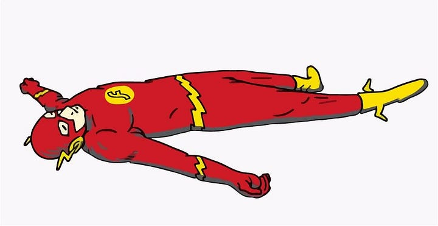
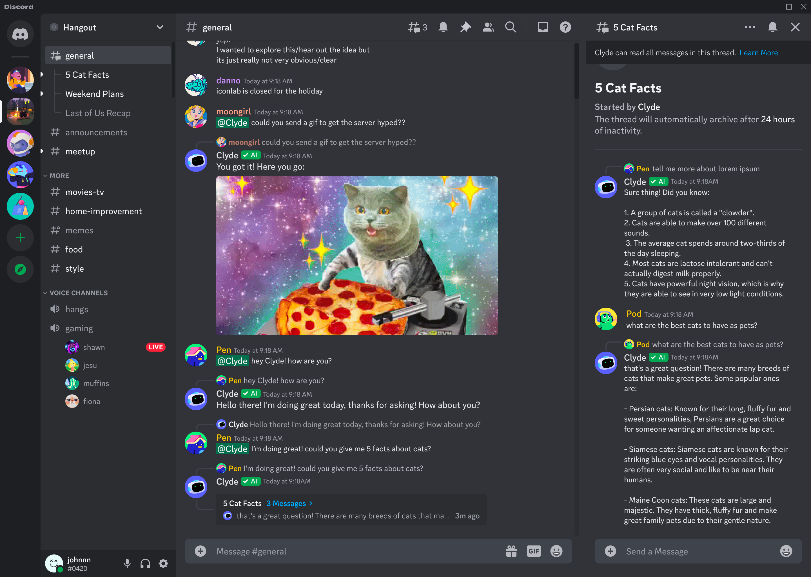
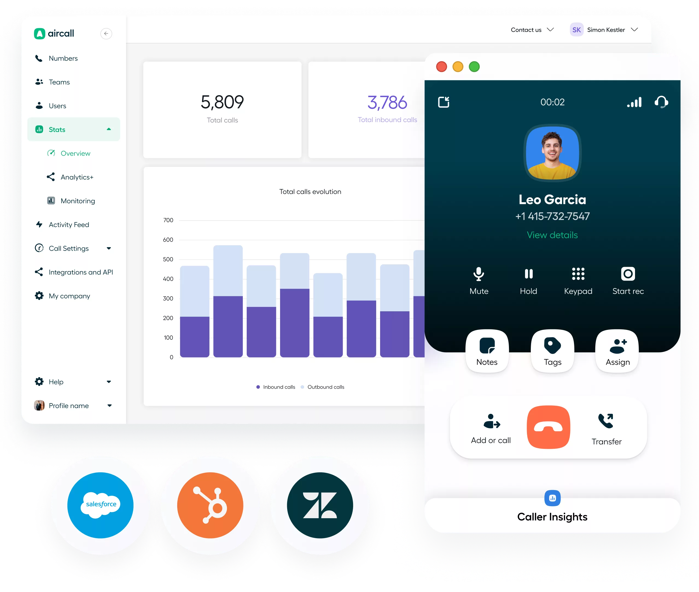
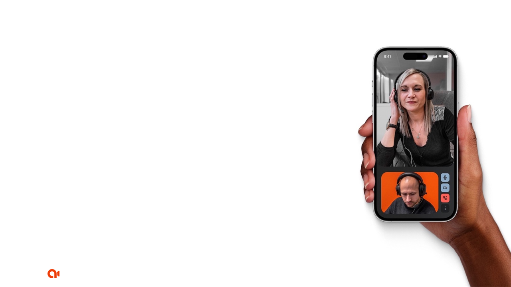
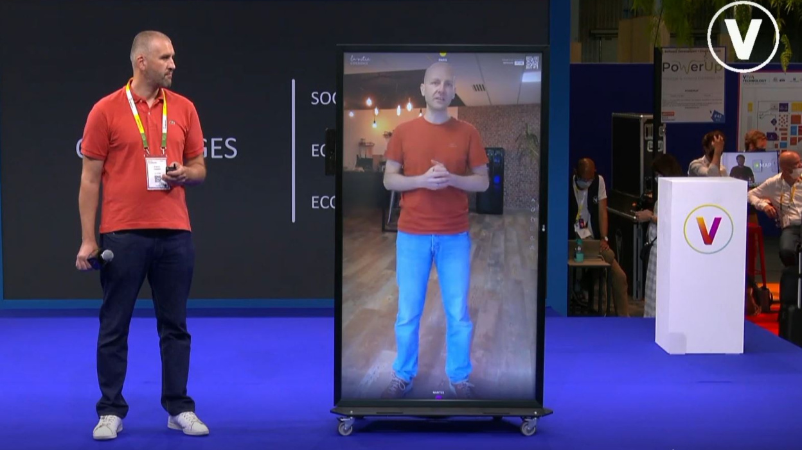
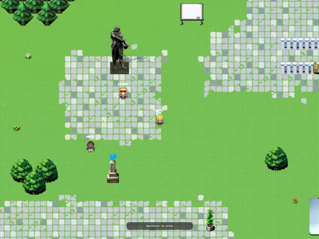
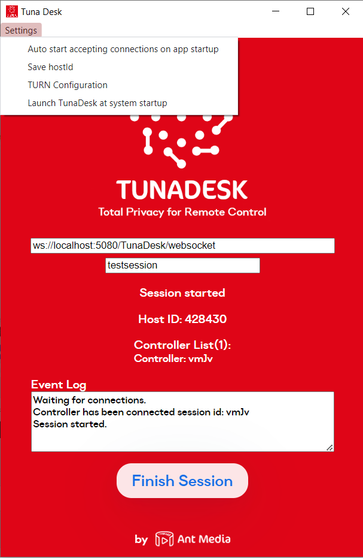
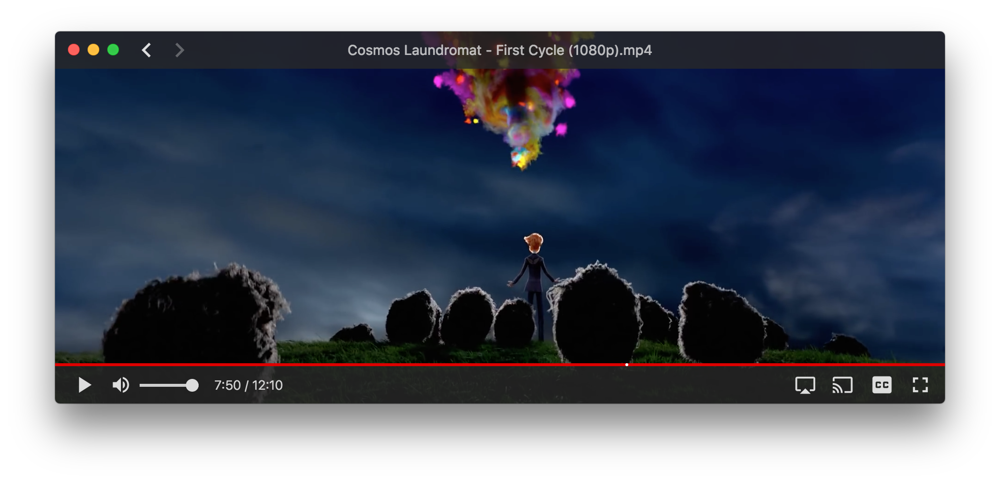
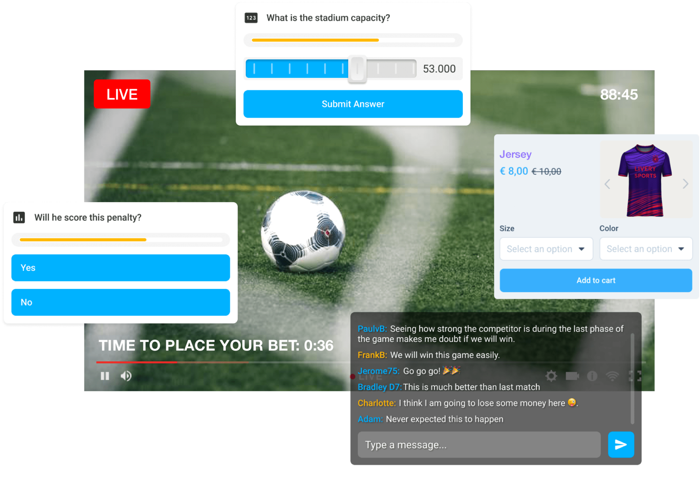
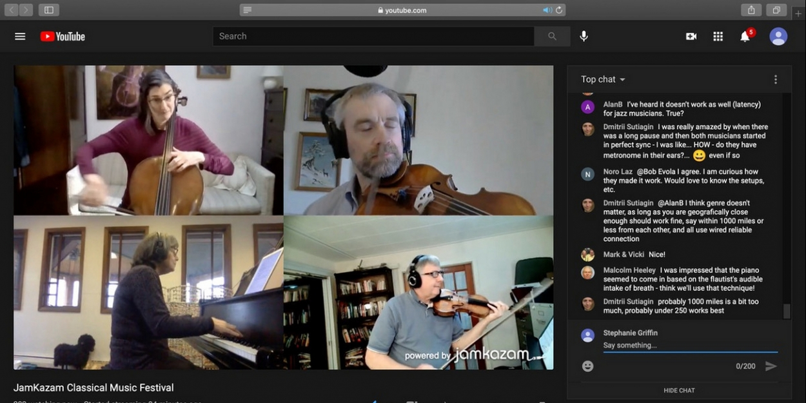

 

# WebRTC extravaganza – Standard browser-to-browser instant communication
## Web Technologies for Application
Jun 2023

---
:wave:
# Romain Vailleux
_Apizee DevRel & Partnership Manager_
WebRTC Paris Meetup | DevFest Perros-Guirec 
@rvailleux@fosstodon.org 

---

# WebRTC - a W3C Standard
2021 - WebRTC becomes a standard 
(per W3C and IETF (Internet Engineering Task Force))

:tada:

---
<!--
backgroundColor: #fff
color: #EF5131
 -->
# W3C - a Community-led Standardization Organization
- Any individual can participate to working groups
- Anyone can be a W3C member (membership fees apply :))
  - Browser Editors
  - End-users Solution providers
- Any member can propose for a new standard
- A standard will succeed only if it is elaborated collectively
- The working group leaders are making sure the consensus is going forward and reached before publication of a news standard.

---
# Yes but what is WebRTC?

---
# Yes but what is WebRTC?
- **P2P**: A protocol to set up a P2P connection across some peers over the Internet
- **Real-time**: A way of exchanging video and audio and data streams (latency < 500ms)
- **Universal**: Implemented in most browsers (desktop and mobile) since 2013 (and any app that implements the W3C standard)
- **Secured**: Streams are sent through encrypted network ensuring integrity and confidentiality (Secured RTP, AES, HMAC-SHA1)
- **For developers**: Javascript APIs and HTML DOM objects

---
# How does it work?

*Scheme by Genesys*

---

# how does it work?

*Scheme by Fatih Erikci*

---

# how does it work?

*Scheme by Fatih Erikci*

---
# Limitations
- Scalability
(look toward HLS or MPEG-DASH protocols for broadcasting use cases)

---

## Instant Video communication
- Chroma key and background replacement
- Real-time image/audio processing
(ex: Google Meet)

---

## Audio chat rooms
(ex: Discord)

---

## Web client for VoIP/CTI
Signaling achieved through classic SIP protocol
(ex: Aircall)

---

# Remote Assistance
(ex: Apizee)

---

## Remote presence
(ex: LaVitre)

---

## Remote presence
(ex: Google Starline)

---

## Virtual workspace
(ex:  Workadventure)

---

## Remote Control
(ex:TunaDesk)

---

## File streaming 
(ex: WebTorrent.io, PeerTube)

---

## Auctions
(ex: https://github.com/dedalusmax/live-auction)

---

## Gambling and Betting

---

## Live Commerce and Shoppable Video

---

## Online Education

---

## Robotic
(ex: Scout, RTCBot)

---

## Telehealth and Remote Monitoring

---

## Emergency Response and Communication

---

## Connected Fitness and Health

---

## Virtual concert
(ex: JamKazam)

---

## Where to start?
1. **Get a view on the architecture** (20min by Tashi): https://www.youtube.com/watch?v=5ci91dfKCyc 
2. **Try plain WebRTC**: https://webrtc.org/ or https://developer.mozilla.org/en-US/docs/Web/API/WebRTC_API or https://web.dev/webrtc-basics/
3. **Find it too hard** and look for shortcuts: some video service platforms offers out-of-the-box WebRTC SDK to speed up and stabilise your app: https://bfy.tw/UBcM

---
## These slides
[On my github account @rvailleux](https://rvailleux.github.io/presentations/W3C_WebRTC_Workgroup_Update/index.html)

---
<!--
backgroundColor: #EF5131
color: #fff
-->
# Thx :pray:
@rvailleux

https://rvailleux.github.io/presentations/W3C_WebRTC_Workgroup_Update/index.html

---
# Worthy advertisement

---
.png)